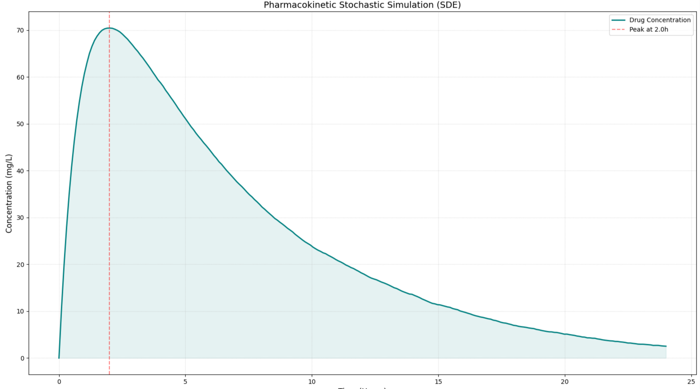

# stoch_pharmacokinetics 

NOTE :- This project was made by me during Jan-Feb 2025, preserved and finally published on Apr 8,'26.

Stochastic Modeling of Pharmacokinetic Decay

==> The simulation utilizes the Euler-Maruyama numerical method to solve the underlying Stochastic Differential Equation (SDE). This approach allows for the integration of deterministic first-order kinetics with Gaussian metabolic noise, providing a more realistic representation of physiological variability than standard ODE solvers.

1. Introduction

==> This project implements a Stochastic One-Compartment Pharmacokinetic (PK) Model. It simulates how a compound is absorbed into and eliminated from the bloodstream over time.

==> By incorporating Brownian Motion (metabolic noise), the simulation moves beyond deterministic equations to model the 'jagged' non-linear reality of biological and financial systems.

==> Similarity to Quantitative Models: This model is mathematically isomorphic to Market Impact Theory. In finance, a 'dose' represents a large trade block, 'absorption' represents the temporary price impact, and 'elimination' represents the market's mean-reversion toward equilibrium.

2. Mathematical Framework

==> The system is modeled using a discrete-time approximation of a Stochastic Differential Equation (SDE).

A. The Governing Equation

==> The change in concentration C at time t is defined as :

$$ dC_t = \underbrace{\left( k_a \cdot D \cdot e^{-k_a t} \right) dt}_{\text{Absorption}} - \underbrace{\left( k_e \cdot C_t \right) dt}_{\text{Elimination}} + \underbrace{\sigma dW_t}_{\text{Metabolic Noise}} $$

where,

  => $k_{a}$ : Absorption rate constant (speed of entry).

  => $k_{e}$ : Elimination rate constant (speed of clearance/decay).

  => $D$ : Initial Dosage (mg).

  => $\sigma dW_{t}$ : The Wiener Process, representing random metabolic fluctuations.

B. Numerical Solver

==> The code utilizes the Euler-Maruyama Method to integrate the SDE.

==> This iterative approach allows us to track the system state across 240 discrete time-steps ($dt$ = 0.1), ensuring high-fidelity results that capture both the trend and the stochastic volatility.

3. Key Metrics & Analytics

==> The simulation extracts three critical 'exposure' metrics used in Clinical Pharmacology and High-Frequency Trading :

 => $C_{max}$ (Peak Concentration): The maximum intensity of the signal before decay dominates.

 => $T_{max}$ (Time to Peak): The efficiency of the absorption phase.

 => Terminal Decay: The residual impact of the 'shock' after a full 24-hour cycle.

4. Visualizing the Dissipative System

==> The resulting output demonstrates the Impulse-Response nature of the system.

 => The Rise: Dominated by the exponential input signal.

 => The Fall: A first-order decay process where the rate of clearance is proportional to the current concentration.

 => The Jitter: Visible noise on the curve representing the stochastic metabolic component, proving the model's robustness against perfect-curve bias.

 ==> Graph 

 

Results 

==> Peak Concentration ($C_{max}$) ~70.50 mg/L (Maximum toxicity risk threshold.)

==> Time to Peak ($T_{max}$) ~2.1 hours (Efficiency of the absorption phase.)

==> 24-hour Residual Level ~2.48 mg/L (Residual impact/market "memory.")
 

5. Environment & Reproducibility
 
==> To ensure the mathematical results are reproducible across different systems, the project utilizes fixed versions of the numeric engine:

 => NumPy :- For high-performance matrix operations and exponential calculations.

 => Matplotlib :- For professional-grade temporal visualization

 6. Installation

=> To clone and run this simulation engine locally, execute the following commands in your terminal :-

```bash
git clone https://github.com/SauravSujitChakraborty/stoch_pharmacokinetics.git
cd stoch_pharmacokinetics
```
=> Create and activate environment :-

```bash
python -m venv venv
# On macOS/Linux:
source venv/bin/activate
# On Windows:
venv\Scripts\activate
```

=> Installing the dependencies :-

```bash
pip install -r requirements.txt
```

